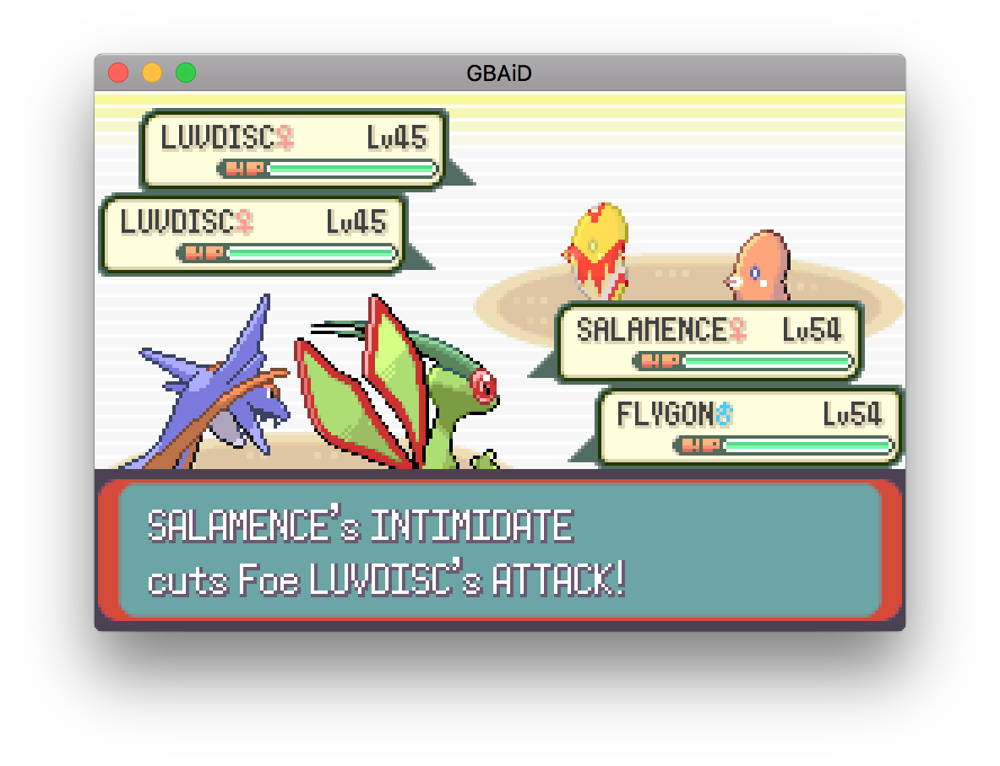

# GBAiD #

GBAiD stands for <strong>G</strong>ame<strong>B</strong>oy <strong>A</strong>dvance <strong>i</strong>n <strong>D</strong>. I've started this project as an effort to learn the D programming language.

This emulator is written mostly in pure D, with some inline x86 (32 and 64 bit) assembly in the display emulation to help with performance.

## Current state ##

All of the GameBoy's built-in hardware has been implemented, except for the serial communication port.

I've tested 8 games so far:
- Super Mario Advance
- Mario kart
- Pokemon Emerald (full play-through completed)
- Pokemon Ruby/Sapphire
- Pokemon Fire Red
- Legend of Zelda: A Link To The Past
- Legend of Zelda: Minish Cap
- Doom
- Classic NES Series: Super Mario Bros
- Classic NES Series: Metroid
- Street Fighter Alpha 3

The emulator uses under 40% CPU on an Intel Core i7-4980HQ (2.80GHz), for a single core.

## Building ##

### Dependencies ###

GBAiD uses [SDL2](https://www.libsdl.org/) for input, OpenGL graphics, sound (eventually) and controller support.  

- SDL 2.0.3 or greater is required
- OpenGL 2.0 or greater is required

### Compiling ###

A D compiler and [DUB](http://code.dlang.org/download)
should be installed. Compiling works with  [LDC](http://wiki.dlang.org/LDC) and [DMD](https://wiki.dlang.org/DMD), other compilers have not been tested.

Then use:

    dub build --build release

It is necessary to build in release mode to have the performance required for the emulator to run at full speed.

LDC has better performance over DMD, use the `--compiler ldc2` option to enable it.

## Running ##

Use:

    dub run --build release -- (arguments)

Again, use `--compiler ldc2` option to enable LDC.

Or get the binary from the `bin` folder after building and use:

    ./gbaid (arguments)

### Arguments ###

At minimum, you must specify the path to the bios and rom images with

    -b (path to bios) (path to rom)

The following arguments are also recognized:

| Long form    | Short form | Argument                 | Usage                                                                       |
|--------------|------------|--------------------------|-----------------------------------------------------------------------------|
| --bios       | -b         | Path to bios             | Specify bios image                                                          |
| --save       | -s         | Path to save             | Specify path for loading and saving saves                                   |
| --noload     | -n         | None                     | Don't load the save                                                         |
| --nosave     | -N         | None                     | Don't save the save, either on exit or quick save                           |
| --scale      | -r         | Scaling factor (float)   | Draw the display at "factor" times the original resolution                  |
| --fullscreen | -R         | None                     | Display in full screen mode (`--scale` will be ignored)                     |
| --filtering  | -f         | LINEAR or NONE           | What technique to use to filter the output texture to be drawn to the screen|
| --upscaling  | -u         | EPX, XBR, BICUBIC or NONE| What technique to use to increase the resolution of the drawn texture       |
| --controller | -c         | None                     | Enable the controller as an input method                                    |
| --raw-audio  | N/A        | None                     | Don't filter the audio output of the emulator; will generally be noisier    |
| --save-memory| N/A        | See saves section        | What memory configuration to use for the main save                          |
| --eeprom     | N/A        | See saves section        | What memory configuration to use for the EEPROM                             |
| --rtc        | N/A        | See saves section        | What memory configuration to use for the RTC                                |

Note that these arguments are case sensitive and that bundling is only supported by the `--noload` and `--nosave` switches.

### Saves ###

Saves use a custom format and `.gsf` extension that is not compatible with other emulators. If no save path is specified,
the same path as the ROM is used, but with the `.gsf` extension instead of whatever the ROM image is using. If no save is
found matching either the given or default path, then a new save is created using that path. Saves are overwritten on exit,
unless the `--nosave` argument is used.

The emulator can almost always auto-detect the save type, but it's not guaranteed to always work. If it doesn't work, then you will need to
use the following switches to configure the save memory manually.

The `--save-memory` switch is used to configure the main save memory. It takes any one of the following arguments (case senstive).

| Argument   | Description         |
|------------|---------------------|
| SRAM       | 64KB of static RAM  |
| FLASH_512K | 512Kb of Flash      |
| FLASH_1M   | 1Mb of Flash        |
| NONE       | No main save memory |
| AUTO       | Decide from the ROM |

The `--eeprom` and `--rtc` switches are used to configure the optional EEPROM and RTC respectively.
They take any one of the following arguments (case senstive).

| Argument | Description         |
|----------|---------------------|
| ON       | Enabled             |
| OFF      | Disabled            |
| AUTO     | Decide from the ROM |

These flags are only needed when creating a new save, after that the format is saved in the save file.

### GBA controls ###

These will be re-mapable in a future version.

| Gamepad | Keyboard | Controller       |
|---------|----------|------------------|
| A       | P        | A                |
| B       | L        | B                |
| Up      | W        | D-pad or L-stick |
| Down    | S        | D-pad or L-stick |
| Right   | D        | D-pad or L-stick |
| Left    | A        | D-pad or L-stick |
| R       | R-shift  | RB or RT         |
| L       | L-shift  | LB or LT         |
| Start   | Enter    | Start            |
| Select  | Tab      | Select           |

### Emulator controls ###

These will be re-mapable in a future version.

| Function   | Keyboard | Controller       |
|------------|----------|------------------|
| Quick save | Q        | X                |

Quick saves are not save states, they just write the contents of the save memory to the save file immediately.
Otherwise this is only done on exit. This is useful to ensure you do not loose game progress if the emulator crashes
or fails to close normally. Note that quick saves are disabled when using the `-N` switch.

### Upscaling ###

All upscaling is implemented as OpenGL shaders.

- EPX is a simple but fast 2x upscaler.
- XBR is a 5x implementation, it gives better results, but is slower.
- BICUBIC is an interpolation method that offers better results than linear filtering at a greater cost.
  It upscales to whatever is defined by the `--scale` switch so it should always be used with this method.

 When you use the `--upscaling` switch you should also use the `--scale` switch with the appropriate factor for the selected algorithm
 (unless you are using the full screen mode).

## License ##

GBAiD is licensed under [MIT](LICENSE.txt)

## TODO ##

- Implement SIO
- Implement emulator networking for SIO
- Remove module cycle in cpu.d, arm.d and thumb.d
- Rewrite IoRegisters to remove the intermediate MonitoredMemory
- Emulator pause feature
- Save states with quick saves
- Replace getters and setters with @property
- Replace most classes with structs

## Useful information ##

[This](http://problemkaputt.de/gbatek.htm) page for a whole lot of detailed information on the hardware.

[This](http://infocenter.arm.com/help/topic/com.arm.doc.ddi0210c/Cacbgice.html) and
[this](http://infocenter.arm.com/help/topic/com.arm.doc.ddi0210c/I1040101.html) for a list of all instructions
supported by the ARM7TDMI CPU.
